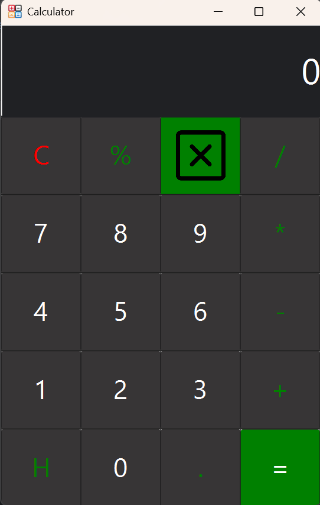

# **A simple calculator using Java**

## **_Introduction_**

- This is a simple calculator using a programming language **Java** with **JavaFx** and **Scene builder**.

## 📋 What you can do

- You can use basic operations like addition, substation, division, multiplication, and percentage.
- You can use **C** for removing numbers.
- it's simple and does not provide advanced features, but you can do most of what calculators do.

### A screenShort for the calculator

### 🔨 Problem need to be fixed:
1. Showing decimals in the output. Example if you calculate (0.5 + 3), it's going to print 3 instead of 3.5 in output.
2. Fix the problem in result after calculating, and then you click two times or more in **equal button**.
3. Solve the problem of dividing on 0.

### 🔧 Improvements
* Add changing operators.
* Add showing result under where you calculate.
* Add a sound after clicking on buttons.
* Add showing operators.
* Make the program calculate more than 2 numbers.

### About me
- Github : [https://github.com/tanjawi-code].
- Version : 1.0.1